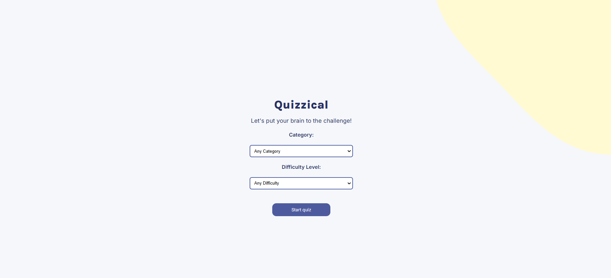
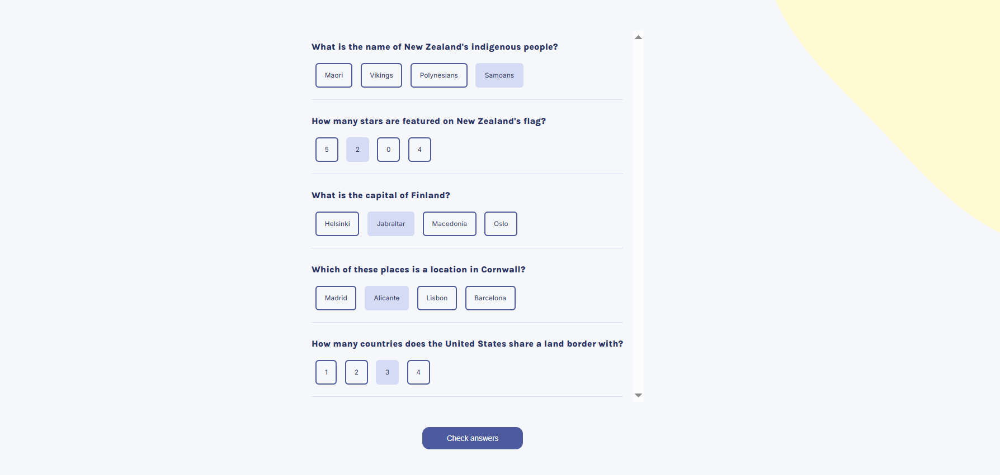
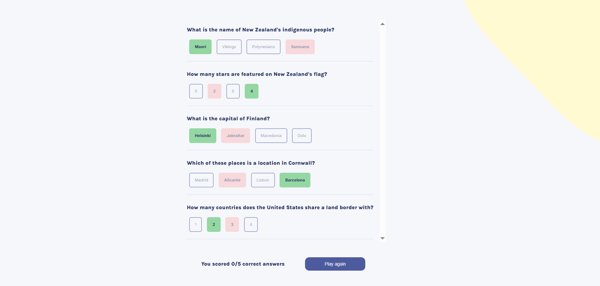
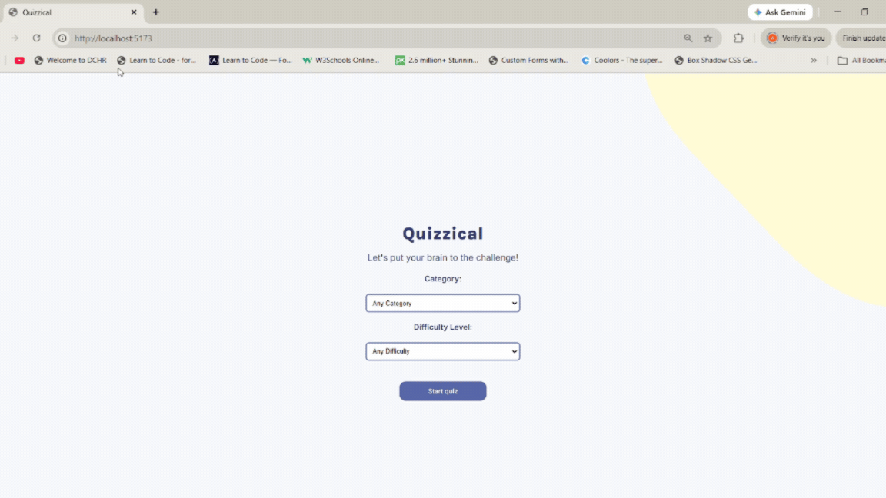

# Solo Project Quiz App
A solo React project from Scrimba’s React.js Fundamentals course, built entirely from scratch. The Quizzical app is a fully interactive trivia quiz that loads five questions from the Open Trivia Database (OTDB) API, tracks user selections, and displays correct and incorrect answers at the end of the game.  The UI and functionality were implemented to match the provided Figma design file and all core project requirements. In addition to the required features, the app includes optional quiz customization, allowing users to select both the category and difficulty level before starting the game.  The project uses conditional rendering to switch between the start screen and the quiz screen. This is handled through React state management and useActionState for quiz form submission.

## Tech Stack
- React
- Vite (with HMR)
- @vitejs/plugin-react 
- ESLint 
- Babel

## Dependencies
- "html-entities": "^2.6.0",
- "react": "^19.2.6",
- "react-dom": "^19.2.6"

## Installation
Clone the repository, navigate into the project folder, and install dependencies:

```bash
npm install
```

## Start the development server

```bash
npm run dev
```

## Requirements 
- Two screens (start & questions)
- Pull 5 questions from the OTDB API
- Tally correct answers after "Check answers" is clicked 
- Use a library to decode the html entities returned by the OTDB API
- Build app per provided Figma design file 


## Usage/Examples


### Start Page



### Questions Page


### Score Tally 


### App Demo



## License

This project is licensed under the MIT License.  
See the [License](./License) file for details.


## Acknowledgements/References

 - [Open Trivia Database API](https://opentdb.com/api_config.php)
 - [html-entities Package](https://www.npmjs.com/package/html-entities#user-content-decodetext-options)
 - [Figma Design File for Quiz App - Scrimba](https://www.figma.com/file/E9S5iPcm10f0RIHK8mCqKL/Quizzical-App?node-id=0%3A1)
 
